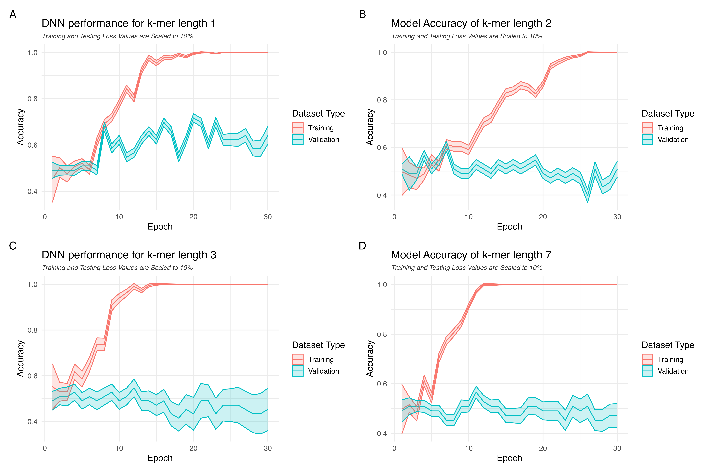

### Introduction

The concept and application of classification is inherent to genomics. Whether the classification is taxonomic, genetic, or chemical- it is vital that information is categorized correctly in order to inform current and future research models. As such, this project aims to compare the efficiency of a random forest (RF) classifier in distinguishing between two genes with similar functions within the taxon Aves, using k-mers of various sizes. Bone Morphogenetic Protein 4 (BMP4) and Alpha-2-HS-Glycoprotein (AHSG) are two genes with similar but significant roles in bone growth, and are predicted to strongly influence organism size [1]. Extracting distinguishing features from both sequences is crucial to studies aiming to taxonomically classify birds, as well as many other mammals.

K-mer analysis is one of many alignment-free techniques used for sequence classification. The choice of k-mer size is critical as it influences the feature representation of sequences and the performance of machine learning algorithms [2]. However, determining the optimal k size for a given set of sequences is an NP-hard problem, and common computational methods perform poorly at large k sizes. Using the Jellyfish program for efficiently computing occurrences of 7-, 14- and 21-mers, I will compare the performance of an RF classifier across small and large k-mers in categorizing BMP4 and AHSG sequences.

#### Load libraries

```{r error = FALSE, message=FALSE, warning=FALSE}
# some global settings
knitr::opts_chunk$set(echo = TRUE) # always include code in output doc
options(install.packages.ask = FALSE) # no need to ask to install packages/dependancies
options(crayon.enabled = FALSE) # could not knit with invalid characters from caret

library("pacman") # pacman automatically checks if a package is installed and (if not, installs it then) loads it into the current environment
pacman::p_load("dplyr", # for performing major dataframe selections/transformations/etc.
               "tidyverse", # has numerous helpful functions I may use
               "readr", # ""
               "rentrez", # for using EUtils, connecting to NCBIs dbs
               "DECIPHER", # for performing and  multiple sequence alignments
               "taxize", # works well with the bold package -> e.g. "downstream" fn reduces load on BOLD query
               "xml2", # for parsing certain entrez responses
               "randomForest", # using an RF model for comparison
               "caret", # for confusion matrices 
               "keras", "tensorflow", # for training the DNN
               "purrr", # I prefer map functions to the base::apply family
               "ggplot2", "patchwork", # better plotting visualization and control than base plots
               update = FALSE,
               dependencies = TRUE) 

```

##### Load other necessary variables

```{r}
# set rentrez API key from environment variable
tryCatch(rentrez::set_entrez_key(Sys.getenv("ENTREZ_KEY")))

# source functions
source("./functions.R")

# set the seed
set.seed(36) # for reproducability. 36 is 18 (lucky number) * 2 (for assignment #2 :)
```

#### Fetch Data from NCBI

```{r}
# load from text file rather than re-run rentrez functions
if (!exists("gene_data") & file.exists("./doc/gene_data.txt")) {
  gene_data <- read_file(file = "./doc/gene_data.txt")
}

# again, only run if necessary
if (!exists("gene_data")) { 
  
  # search from NCBI's gene database for either gene in Aves returns ~ 300 entries
  genes_query <- rentrez::entrez_search(db = "gene", 
                                        term = '(BMP4 OR AHSG OR "Alpha 2-HS Glycoprotein" OR "bone morphogenetic protein 4") AND "Aves"[porgn] AND alive[prop]',
                                        use_history = TRUE) # using web_history object to mitigate size-issues in the subsequent API request
  
  # pull info for each entry using web_history object
  gene_data <- rentrez::entrez_fetch(db = "gene", web_history = genes_query$web_history, rettype = NULL, retmode = "default")
}

# save as text file rather than re-run rentrez functions
if (!file.exists("./doc/gene_data.txt")) {
  write(gene_data, file = "./doc/gene_data.txt")
}
```

```{r echo = FALSE, error = FALSE, eval = FALSE, include = FALSE}
# not needed in output ^^. just to show that yes, I did look at my data before working with it
gene_data %>% cat # entries are formatted consistently, can apply a vectorized function...
```

```{r}
# split up each entry for parsing
entries <- str_split(gene_data, "\\n\\d+\\.\\s+")[[1]] %>% # split at each integer followed by a '.' and at least one whitespace character
  trimws # trim white space around each line

entries %>%
    strsplit(split = "\n") %>% # split into substrings by newline
    .[[20]] %>% # take the 20th entry, for example
    cat(sep = "\n") # concatenate the entry by newline

# Apply vectorized function to extract the ID, gene name, species name, accession ID and the start/stop bp numbers identifying where the gene resides within the fasta file for said accession ID.
df_spec <- purrr::map_dfr(entries, extract_info) # equivalent (though faster) to base::apply but output is a dataframe

# Checking for genes names in df_spec
unique(df_spec$gene)

# keep only the rows where the gene name is BMP4 or AHSG (some entries are from rentrez returning similar genes such as BMP7 or PAX6, which are also involved in bone development)
df_spec <- df_spec %>%
    mutate(gene = str_trim(gene)) %>%  # Remove any leading/trailing whitespace or special characters
    filter(gene %in% c("BMP4", "AHSG")) %>% # still ~ 270 observations
                drop_na # remove rows with NAs using tidyr's drop_na fn

# Visualize
df_spec %>% head(3)
```

```{r warning = FALSE}
# load from file if already run previously
if (file.exists("./doc/df_seqspec.tsv")) {
  df_seqspec <- read_tsv("./doc/df_seqspec.tsv", show_col_types = FALSE)
}

# "" otherwise:
if (!exists("df_seqspec")) {
  # apply vectorized function that leverages purrr's pmap ("parallel" map) to iterate over each row in df_spec and perform the entrez_fetch() using multiple column values in df_spec.
  ls_fastas <- pmap(df_spec[,c("accession_id", "bp_start", "bp_stop")],
                    function(accession_id, bp_start, bp_stop) {
                      return(entrez_fetch(db = "nuccore", rettype = "fasta", 
                                   id = accession_id, seq_start = bp_start, seq_stop = bp_stop))
                      Sys.sleep(0.1) # to avoid rate-limiting
  })
  
  # export fastas to file, for use with Jellyfish later 
  ls_fastas %>%
    unlist %>% # flatten to 
    writeLines(., con = "./doc/BMP4_AHSG_Aves.fasta")
  
  # clean fasta files (remove header)
  clean_fastas <- map(ls_fastas, clean_fasta)

  # convert to dataframe and bind to df_spec
  df_seqspec <- do.call(rbind, clean_fastas) %>% # bind rows
                as.data.frame %>% # convert to df
                setNames("sequence") %>% # set the column name to "sequence"
                cbind(df_spec, .) # bind to df_spec
  
  # save as file
  write_tsv(df_seqspec, file = "./doc/df_seqspec.tsv")
}

# write fasta files for each gene to two separate folders, to be used in counting k-mers and training classifiers
if (!file.exists("./data/AHSG/NC_021681.1.fasta")) { # test case, it will exist only if this code is run
  write_fasta_files(df_seqspec[,c("gene", "accession_id", "sequence")])
}
# drop unnecessary rows
df_seqspec <- df_seqspec[, c("gene", "species_name", "accession_id", "sequence"), drop = TRUE]

```

#### Function: Sequence Quality Check, Clean and Filter Based on Gaps and "N" Content ----

```{r}
quality_check_and_filter_sequences <- function(df) {
  # Initialize a list to store quality check results
  Results <- list()
  
  # Count initial number of sequences
  initial_count <- nrow(df)
  
  # Quality Checks
  # Check for sequences containing gaps ('-')
  Results$gaps_count <- sum(str_detect(df$sequence, "-"))
  
  # Check for sequences starting with 'N'
  Results$start_N_count <- sum(str_detect(df$sequence, "^N"))
  
  # Check for sequences ending with 'N'
  Results$end_N_count <- sum(str_detect(df$sequence, "N$"))
  
  # Clean sequences
  df <- df %>%
    mutate(
      sequence = str_remove(sequence, "^[-N]+"),  # Remove leading gaps and 'N's
      sequence = str_remove(sequence, "[-N]+$"),  # Remove trailing gaps and 'N's
      sequence = str_remove_all(sequence, "-+")   # Remove all remaining gaps
    )
  # Check for sequences with high 'N' content (>=5% of sequence length)
  Results$high_N_content_count <- sum(str_count(df$sequence, "N") >= (0.05 * str_length(df$sequence)))
  
  # Print quality check results
  cat("Quality Check Results:\n")
  cat("Count of sequences with gaps:", Results$gaps_count, "\n")
  cat("Count of sequences starting with 'N':", Results$start_N_count, "\n")
  cat("Count of sequences ending with 'N':", Results$end_N_count, "\n")
  cat("Count of sequences with high 'N' content:", Results$high_N_content_count, "\n")
  
  # Filter sequences with high 'N' content
  df <- df %>%
    filter(str_count(sequence, "N") < (0.05 * str_length(sequence)))  # Remove sequences 
    
  
  # Calculate number of final and filtered out sequences 
  final_count <- nrow(df)
  filtered_count <- initial_count - final_count
  
  # Print the number of initial, filltered out and final sequences
  cat("Initial sequence count:", initial_count, "\n")
  cat("Total sequences filtered out:", filtered_count, "\n")
  cat("Final sequence count:", final_count, "\n")
  
  # Return the filtered dataframe
  return(df)
}

# Apply the sequence quality check and filtering function to df_seqspec
df_seqspec <- quality_check_and_filter_sequences(df_seqspec)

```

```{r}
# show quartiles for sequence length in AHSG and BMP4, respectively
cat("Summary of quartiles in sequence lengths for AHSG \n")
df_seqspec %>%
  filter(gene == "AHSG") %>%
  pull(sequence) %>%
  width %>%
  summary
cat("\n Summary of quartiles in sequence lengths for BMP4 \n")
df_seqspec %>%
  filter(gene == "BMP4") %>%
  pull(sequence) %>%
  width %>%
  summary
```

### Filter outliers with very long sequences ----
```{r echo = TRUE, fig.show = "hide"}

# Extract sequence lengths for each gene
ahsg_lengths <- nchar(df_seqspec %>% filter(gene == "AHSG") %>% pull(sequence))
bmp4_lengths <- nchar(df_seqspec %>% filter(gene == "BMP4") %>% pull(sequence))
# Initial boxplot of sequence lengths by gene
boxplot(ahsg_lengths, bmp4_lengths,
        names = c("AHSG", "BMP4"), 
        main = "Initial Distribution of Sequence Lengths by Gene",
        ylab = "Sequence Length",
        col = c("lightblue", "lightgreen"))
# Filter out BMP4 sequences with lengths greater than 5000 (extreme outliers)
df_seqspec <- df_seqspec %>%
  filter(!(gene == "BMP4" & nchar(sequence) > 5000)) 
# Check the count of sequences for each gene
table(df_seqspec$gene)
# Extract sequence lengths for each gene after filtering outliers
ahsg_lengths <- nchar(df_seqspec %>% filter(gene == "AHSG") %>% pull(sequence))
bmp4_lengths <- nchar(df_seqspec %>% filter(gene == "BMP4") %>% pull(sequence))
# Boxplot of sequence lengths by gene after filtering
boxplot(ahsg_lengths, bmp4_lengths,
        names = c("AHSG", "BMP4"), 
        main = "Distribution of Sequence Lengths by Gene (Filtered)",
        ylab = "Sequence Length",
        col = c("lightblue", "lightgreen"))
# Filtered out extreme outliers with sequence length > 5000. 
# Filtering by quartiles was not feasible, as it would have reduced the dataset to only 124 sequences across both genes.
```

# Function to calculate k-mer frequencies for DNA sequences in a dataframe
```{r}
calculate_kmer_frequencies <- function(df_seqspec, k) {
  df_kmer <- df_seqspec$sequence %>%
    DNAStringSet() %>%  # Convert sequences to DNAStringSet for DNA operations
    oligonucleotideFrequency(width = k, as.prob = TRUE) %>% # Calculate k-mer frequencies as proportions
    as.data.frame() %>%  # Convert the result to a dataframe for further manipulation
    mutate_all(~ round(., 2)) %>%                 # Round all frequency values to 2 decimal places
    cbind(df_seqspec[, c("gene", "accession_id"), drop = TRUE], .) # Combine with gene and accession_id columns
  
  return(df_kmer) # Return the resulting dataframe with k-mer frequencies
}

# Calculate 1-mer, 2-mer, and 3-mer frequencies using the kmer_function
df_1mer <- calculate_kmer_frequencies(df_seqspec, 1)
df_2mer <- calculate_kmer_frequencies(df_seqspec, 2)
df_3mer <- calculate_kmer_frequencies(df_seqspec, 3)
```

##### Generate a density plot of the probabilities of 1-, 2-, and 3-mer frequencies

```{r}
# add a column to each data frame to indicate k-mer size
df_1mer_hist <- df_1mer %>% mutate(kmer_size = "1-mer")
df_2mer_hist <- df_2mer %>% mutate(kmer_size = "2-mer")
df_3mer_hist <- df_3mer %>% mutate(kmer_size = "3-mer")

# combine data frames
df_combined <- bind_rows(df_1mer_hist, df_2mer_hist, df_3mer_hist)

# reshape to long format (each k-mer probability in one row)
df_long <- df_combined %>%
  pivot_longer(cols = -c(accession_id, gene, kmer_size), names_to = "kmer", values_to = "probability")

# Plot density of k-mer probabilities by gene and k-mer size
densityplot <- ggplot(df_long, aes(x = probability, fill = gene, color = gene)) +
  # Adjust transparency and outline size
  geom_density(alpha = 0.3, linewidth = 0.8) +
  
  # Set different colors for each gene
  scale_fill_manual(values = c("AHSG" = "#E69F00", "BMP4" = "#56B4E9")) +
  scale_color_manual(values = c("AHSG" = "#D55E00", "BMP4" = "#0072B2")) +
  
  # Facet by k-mer size with independent y-axes
  facet_wrap(~ kmer_size, scales = "free") +
  
  # Add labels for axes, title, and subtitle
  labs(
    x = "Probability of k-mer Occurrence", 
    y = "Density",                           
    title = "Density Plot of k-mer Probabilities for Different k-mer Sizes",   
    subtitle = "Comparison of AHSG and BMP4 genes"
  ) +
  
  # Minimal theme for a clean look
  theme_minimal() + 
  
  # Customize plot theme for improved readability and styling
  theme(
    plot.title = element_text(hjust = 0.5, face = "bold", size = 20),
    plot.subtitle = element_text(hjust = 0.5, size = 18),
    axis.title = element_text(size = 18, face = "bold"),
    axis.text = element_text(size = 16),
    strip.text = element_text(size = 18, face = "bold"),
    legend.position = "top",
    legend.title = element_blank(),
    legend.text = element_text(size = 16, face = "bold")
  )

# Save the plot if it doesn't already exist
if (!file.exists("./figs/small_mer_densityplot.png")) {
  ggsave(filename = "./figs/small_mer_densityplot.png", plot = densityplot, width = 12, height = 8, dpi = 600)
}
# Show plot in R markdown (below)
```


```{r eval = FALSE}
# I attempted to compute larger k-mers using Jellyfish (installed in the bash shell according to the instructions on gmarcais/jellyfish github)

# I commented out certain lines since Jellyfish is likely only installed on my computer

#system("jellyfish --version") # check that jellyfish is working in the current R proj. directory

# computing 7-, 14- and 21-mers
#file_paths <- c(list.files("./doc/BMP4", full.names = T),
#                list.files("./doc/AHSG", full.names = T))
# jellyfish(file_paths) # takes a very long time to run

# load from tsv files
if (file.exists("./doc/df_7mer.tsv")) {
  df_7mer <- read_tsv("./doc/df_7mer.tsv", show_col_types = FALSE)
  df_7mer[is.na(df_7mer)] <- 0 # replace NAs with 0
} else {
  df_7mer <- bind_rows( # load data for each k-mer size
    kmer_counts_from_files("./doc/BMP4", 7),
    kmer_counts_from_files("./doc/AHSG", 7)
  )
  write_tsv(df_7mer, "./doc/df_7mer.tsv")
  rm(df_7mer) # must be removed from local memory to proceed, otherwise my computer crashes
}
# again for 14-mers. My computer was not able to run this, I had to run it on another computer that has 16GB RAM
#if (file.exists("./doc/df_14mer.tsv")) {
#  df_14mer <- read_tsv("./doc/df_14mer.tsv", show_col_types = FALSE)
#  df_14mer[is.na(df_14mer)] <- 0 # ""
#} else {# Load data for each k-mer size
#  df_14mer <- bind_rows(
#    kmer_counts_from_files("./doc/BMP4", 14),
#    kmer_counts_from_files("./doc/AHSG", 14)
#  )
#  write_tsv(df_14mer, "./doc/df_14mer.tsv")
#  rm(df_14mer) # must be removed from local memory to proceed, otherwise my computer crashes
#}

# My computer was not able to compute 21-mers, neither was a 16GB RAM computer.
#if (file.exists("./doc/df_21mer.tsv")) {
#  df_21mer <- read_tsv("./doc/df_21mer.tsv", show_col_types = FALSE)
#  df_21mer[is.na(df_21mer)] <- 0 # ""
#} else {# Load data for each k-mer size * not run
#  df_21mer <- bind_rows(
#    kmer_counts_from_files("./doc/BMP4", 21),
#    kmer_counts_from_files("./doc/AHSG", 21)
#  )
#  write_tsv(df_21mer, "./doc/df_21mer.tsv")
#  rm(df_21mer) # must be removed from local memory to proceed, otherwise my computer crashes
#}
```

#### Train random forest classifier

```{r}
# apply defined function to each set of kmer data
if(!file.exists("./doc/confusionMatrix_7mer.txt")) {
  map2(list(df_1mer, df_2mer, df_3mer, df_7mer), 
     c("1", "2", "3", "7"),
    RF_confMatrix)
}

# an example of the computed confusion matrices
cat("An example of the computed confusion matrices, for 1-mer data\n")
readRDS("./doc/confusionMatrix_1mer.txt")
```

Table 1: Summary of RF classification metrics, where *AHSG* is the positive class and *BMP4* is the negative class.

| Model  | 95% CI (Accuracy) | Sensitivity | Specificity | Kappa |
|--------|-------------------|-------------|-------------|-------|
| 1-mers | (93.23%, 99.97%)  | 97.56%      | 100.00%     | 97.5% |
| 2-mers | (95.49%, 100%)    | 100%        | 100%        | 100%  |
| 3-mers | ""                | ""          | ""          | ""    |
| 7-mers | ""                | ""          | ""          | ""    |

#### Train Deep Neural Network Classifier

```{r, eval = FALSE, message=FALSE, warning=FALSE, sanitize=TRUE}
# I included only the example for 1mers, as I struggled to vectorize the code and I would have been over the page limit. However, the only change I made was to "k".

# one-hot encode sequence data
one_hot_encoded_data <- lapply(df_seqspec$sequence, one_hot_encode)

# first bind the feature matrix and labels
feature_matrix <- t(sapply(df_seqspec$sequence, generate_kmer_counts, k = 1))
training_data <- data.frame(feature_matrix, label = as.factor(df_seqspec$gene))

# split  data into training and test (70/30 split)
trainIndex <- createDataPartition(training_data$label, p = 0.7, list = FALSE)
testIndex <- setdiff(seq_len(nrow(training_data)), trainIndex)
train_data <- training_data[trainIndex, ]
test_data <- training_data[-trainIndex, ]

# need to define model input shape for tensorflow
sequence_length <- ncol(one_hot_encoded_data[[1]])
input_shape <- c(sequence_length, 4) # 4 for A, T, G and C

# define the layers and parameters in the model, according to reference [3]
model <- keras_model_sequential()
# add layers individually
model$add(layer_conv_1d(filters = 64, kernel_size = 16, activation = "relu", input_shape = input_shape))
model$add(layer_max_pooling_1d(pool_size = 13, strides = 13))
model$add(bidirectional(layer = layer_lstm(units = 64, return_sequences = TRUE)))
model$add(layer_dropout(rate = 0.5))
model$add(layer_flatten())
model$add(layer_dense(units = 512, activation = "relu"))
model$add(layer_dropout(rate = 0.5))
model$add(layer_dense(units = 1, activation = "sigmoid"))

# compile using TensorFlow
tf$keras$models$Sequential$compile(
  model,
  loss = "binary_crossentropy",
  optimizer = "adam",
  metrics = list("accuracy")
)

# convert list of matrices to array
train_x <- array(unlist(one_hot_encoded_data[trainIndex]), dim = c(length(trainIndex), sequence_length, 4))
test_x <- array(unlist(one_hot_encoded_data[-trainIndex]), dim = c(length(testIndex), sequence_length, 4))
# add labels
train_y <- as.numeric(train_data$label == "AHSG")  # Adjust labels as needed
test_y <- as.numeric(test_data$label == "BMP4")

# convert train and test data to TensorFlow-compatible format
train_x <- array_reshape(train_x, dim = c(dim(train_x)[1], dim(train_x)[2], dim(train_x)[3]))
test_x <- array_reshape(test_x, dim = c(dim(test_x)[1], dim(test_x)[2], dim(test_x)[3]))
train_y <- as.array(train_y)
test_y <- as.array(test_y)

# I could only fit using TensorFlow's backend format
history_1mer <- tf$keras$models$Sequential$fit(
  model,
  x = train_x,
  y = train_y,
  epochs = as.integer(30),
  batch_size = as.integer(32),
  validation_data = list(test_x, test_y)
)

# save history object
history_metrics <- list(
  accuracy = history_1mer$history$accuracy,
  val_accuracy = history_1mer$history$val_accuracy,
  loss = history_1mer$history$loss,
  val_loss = history_1mer$history$val_loss
)
saveRDS(history_metrics, file = "./doc/DNN_history_1mer.rds")# Create figure comparing accuracy per epoch for all the trained models

```

#### Create plots for DNN results

```{r}
# Create plot comparing accuracy, loss, val_accuracy and val_loss for the four (1, 2, 3, 7) models
p1 <- DNN_plot("./doc/DNN_history_1mer.rds", k = 1)
p2 <- DNN_plot("./doc/DNN_history_2mer.rds", k = 2)
p3 <- DNN_plot("./doc/DNN_history_3mer.rds", k = 3)
p4 <- DNN_plot("./doc/DNN_history_7mer.rds", k = 7)

# Output as one figure
combined_plot <- (p1 + p2 + p3 + p4) +
  plot_layout(ncol = 2, nrow = 2) +
  plot_annotation(tag_levels = 'A')  # Labels each plot as A, B, C, D

# Save plot
if (!file.exists("./figs/DNN_performance.png")) {
  ggsave(filename = "./figs/DNN_performance.png", plot = combined_plot, width = 12, height = 8, dpi = 600)
}
```



### Results and Discussion

The significant range in size of the BMP4 sequences presented a challenge for alignment-based methods- some of the issues that arose during my preliminary analysis were 1. long stretches of gaps in shorter sequences 2. increased computational load due to the largest sequences being \> 150 kbps and 3. loss of resolution in phylogenetic comparisons between species. Instead, k-mers were used for classification, and lengths 1, 2, 3, and 7 were compared as features for an RF classifier and a hybrid-DNN inspired by DanQ [3]. The RF classifier performed well even for kmers of length 1, implying that the genes were not similar enough to present a challenge. In the future I would attempt the same pipeline on more similar genes, such as two BMP class genes[1]. The performance of the RF classifier did not improve after k \> 2, likely for the above reason (Table 1). Interestingly, the DNN performed okay on 1-mers (\~ 60% accuracy) , but began overfitting after epoch 25 (Fig 2A). The DNN performed worse on 2-, 3- and 7-mers and had extreme overfitting on each (Fig 2B-D).

This pipeline has potential for improvement in both the model parameters (of both RF and DNN) and the quality of the input data. What I find particularly interesting is that the DNN may outperform the RF as the number of classification bins increases (i.e. from a binary classificiation problem of BMP4 or AHSG, to factors of species as well) [3].

##### Acknowledgments

I would like to thank Brittany for giving me an extension, and though I was still not able to complete the components of the pipeline I wished to, I learned a lot.

##### References

1.  Wu, L., Jiao, X., Zhang, D., Cheng, Y., Song, G., Qu, Y., and Lei, F. (2021). Comparative genomics and evolution of avian specialized traits. Current Genomics 22, 496–511. <https://doi.org/10.2174/1389202923666211227143952>.

2.  Marçais, G., and Kingsford, C. (2011). A fast, lock-free approach for efficient parallel counting of occurrences of k-mers. Bioinformatics 27, 764–770. <https://doi.org/10.1093/bioinformatics/btr011>.

3.  Quang, D., and Xie, X. (2016). DanQ: a hybrid convolutional and recurrent deep neural network for quantifying the function of DNA sequences. Nucleic Acids Research *44*, e107. <https://doi.org/10.1093/nar/gkw226.>
